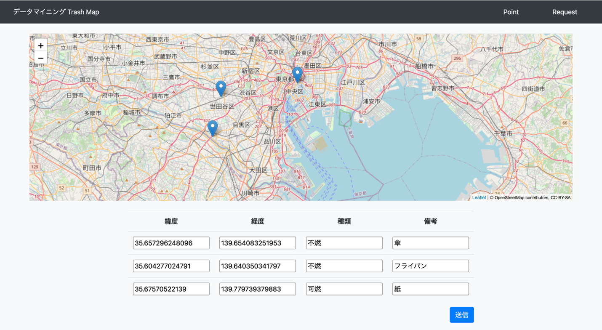
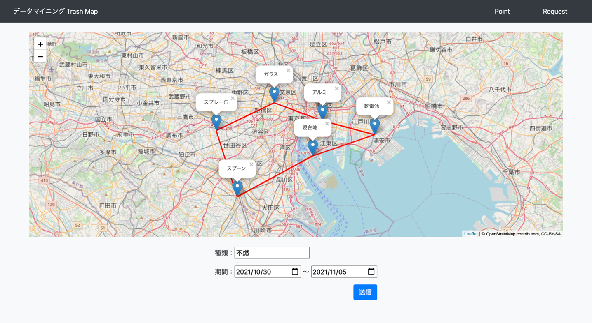
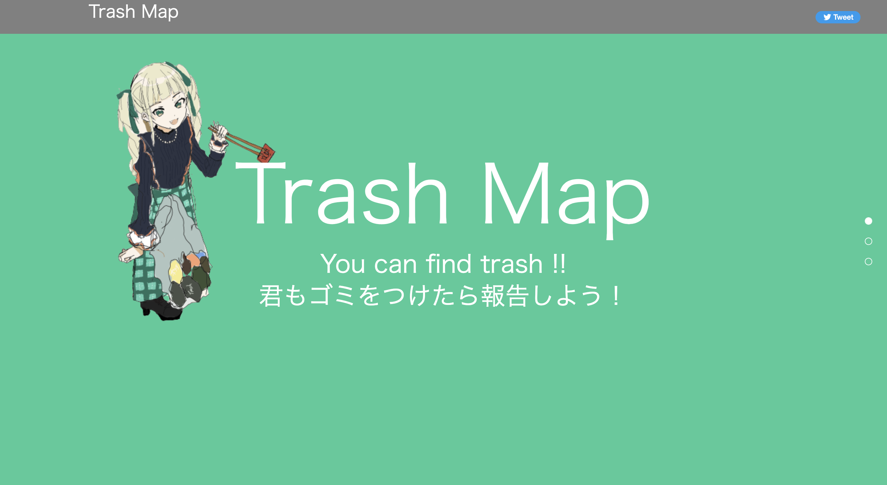

# trash-map

### Djangoを用いて開発したゴミ収集支援アプリケーションです
- ゴミを発見したユーザがその情報を投稿
- ゴミを収集するユーザが条件に当てはまるポイントを最短で巡る経路をフィードバック

### Motivation
- 渋谷のハロウィンなどのイベントにおける路上ゴミ問題を解決したいと考え開発しました

### Trick
- 種類/備考の欄を追加
- 巡回セールスマン問題は探索時間が爆発的に増加するので、上限数の設定
- Leafletを用いたUI向上

### 発見側ユーザ（デモ）

### 収集側ユーザ（デモ）

### [デプロイURL](https://trash-map-muds.herokuapp.com/)
- contributors
    - user:NakahodoRintaro
    - user:RyosukeNAKATA

### 環境
- python3.8
- geopy 2.2.0
- mip 1.12.0
- sqlite3 3.36.0
